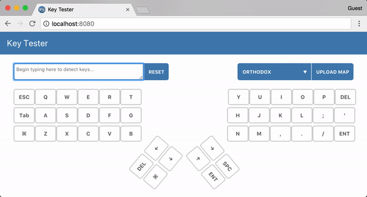

# Key Tester

Test which keys on your keyboard are working. Upload your own keymap if you have one.



## Development Setup

``` bash

# Install the project's dependencies
npm install

# Serve with hot reload at localhost:8080
npm run dev

# Production build
npm run build

# Run all tests
npm test
```
